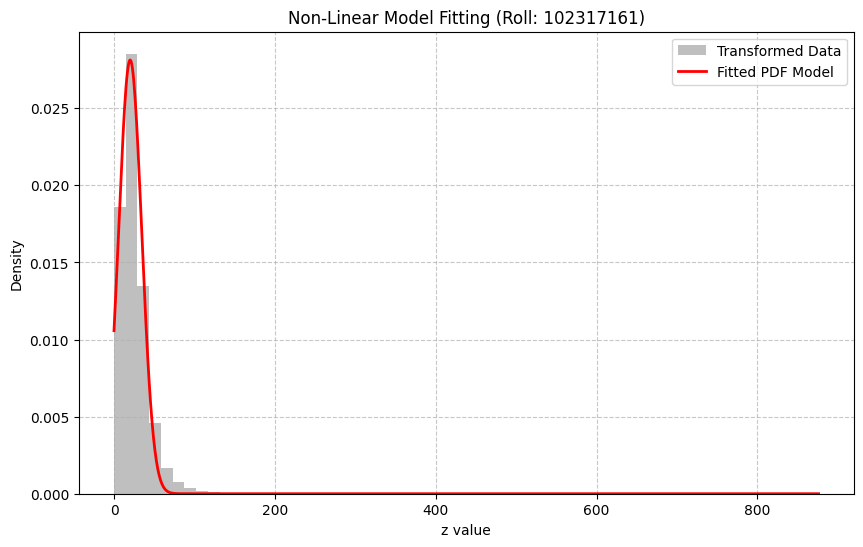

# Advance_Mathematics_Assignment
## Learning Probability Density Functions Using Roll-Number-Parameterized Non-Linear Model

---

## 1. Methodology

### Data Collection → Data Pre-Processing → Non-Linear Transformation → Probability Density Function Learning → Parameter Estimation → Result Analysis

---

## 2. Description

- **Dataset:** India Air Quality Data (Kaggle)
- **Feature Used:** NO₂ (Nitrogen Dioxide)
- **Transformation Type:** Roll-number-parameterized non-linear transformation
- **Probability Model:** Gaussian-like Probability Density Function
- **Estimation Technique:** Curve fitting / numerical optimization
- **University Roll Number:** 102317161

### Roll Number Based Parameters

- r mod 7 = 2 → aᵣ = 0.05 × 2 = **0.10**
- r mod 5 = 1 → bᵣ = 0.3 × (1 + 1) = **0.60**

### Transformation Function

z = x + 0.10 · sin(0.60x)

---

## 3. Input / Output

### Input
- Raw NO₂ concentration values extracted from the dataset.

### Output
- Transformed variable (z).
- Predicted probability density values.

## 4. Probability Density Function Model

The probability density function learned for the transformed variable z is:

p̂(z) = c · e^(−λ(z − μ)²)

Where:
- λ controls the spread of the distribution  
- μ represents the mean  
- c is the normalization constant  

The parameters λ, μ, and c are estimated using numerical optimization based on the transformed data.

---

## 6. Result Analysis

Using the transformed NO₂ data, the estimated parameters of the probability density function are:

- Spread parameter (λ) = 0.00242798  
- Mean (μ) = 20.07453836  
- Normalization constant (c) = 0.02812794   

These parameters define the learned probability density function for the transformed NO₂ data and are used to generate the fitted distribution shown in the result graph.

---

## 5. Result Graphs

---

## 7. Implementation Details

- **Platform:** Google Colab  
- **Programming Language:** Python  
- **Libraries Used:**
  - NumPy
  - Pandas
  - Matplotlib
  - SciPy

---

## 8. Conclusion

This assignment demonstrates the application of roll-number-parameterized non-linear transformations combined with probabilistic modeling for learning probability density functions. The approach effectively models real-world air quality data and highlights the importance of parameter estimation in statistical learning.

